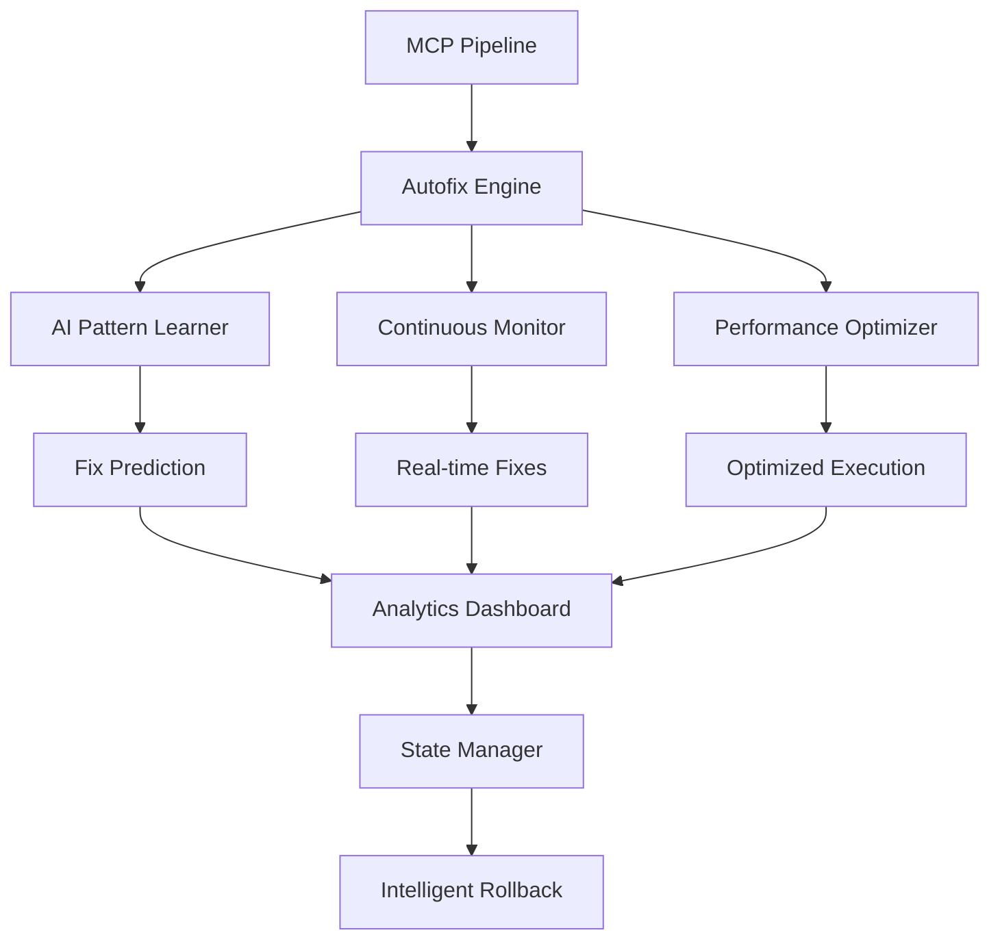
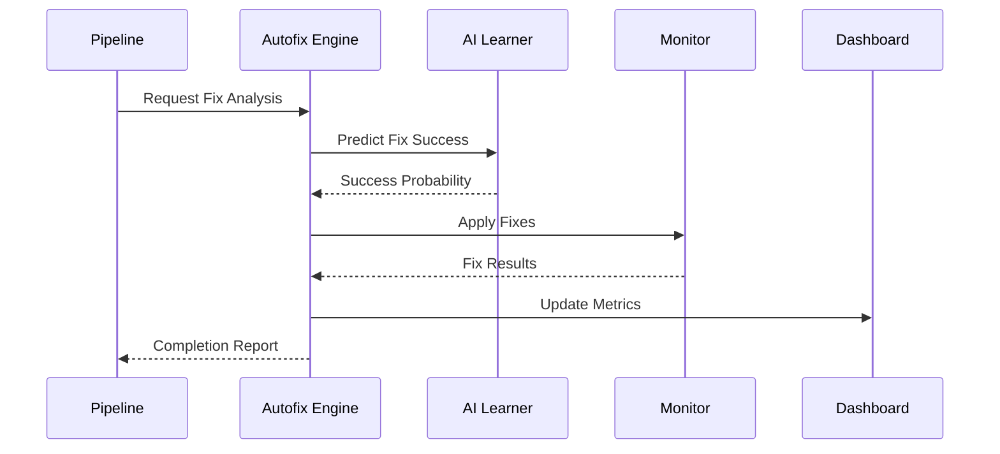

# Autofix Improvement Plan - Next Generation Enhancements
## Strategic Evolution of MCP Autofix System

### 🎯 Executive Summary

This improvement plan strategically enhances the existing robust autofix system with next-generation capabilities including AI-powered pattern learning, real-time continuous improvement, and advanced integration with the MCP pipeline ecosystem.

**Current State**: 90% automation with 7-phase comprehensive fixing
**Target State**: 95%+ automation with adaptive intelligence and continuous learning

---

## 📊 Current System Analysis

### ✅ Existing Capabilities (ENHANCED_AUTOFIX_PIPELINE_PLAN.md)
- **Security Autofix**: 124+ security patterns with bandit integration
- **Code Quality**: Black, isort, flake8, mypy integration
- **Function Resolution**: AST-based undefined function detection and fixing
- **Duplicate Elimination**: Fingerprint-based consolidation to utils modules
- **Type Error Fixing**: Intelligent type annotation and mismatch resolution
- **Test Repair**: Basic test failure analysis and import fixing
- **Whitespace & Formatting**: Comprehensive code cleanup

### 🔍 Identified Improvement Areas
1. **Pattern Learning**: Static fixes vs adaptive improvement
2. **Performance**: Sequential processing vs intelligent parallelization
3. **Integration**: Isolated tool vs pipeline-native component
4. **Monitoring**: Basic reporting vs real-time analytics
5. **Rollback**: Simple git restore vs sophisticated state management
6. **AI Enhancement**: Rule-based vs machine learning-powered

---

## 🚀 Strategic Improvements

### 1. AI-Powered Pattern Learning Engine

#### **Objective**: Transform static fix patterns into adaptive, learning system

```python
# New Component: scripts/autofix_modules/ai_pattern_learner.py
class AIPatternLearner:
    """
    Machine learning system that improves fix patterns based on:
    - Success rates of applied fixes
    - Code review feedback patterns
    - Community best practices analysis
    - Regression pattern detection
    """
    
    def __init__(self):
        self.pattern_database = {}
        self.success_metrics = {}
        self.learning_model = None
    
    def learn_from_session(self, session_results):
        """Analyze session results to improve future fixes"""
        # Extract successful vs failed patterns
        # Update confidence scores for fix types
        # Retrain model with new data
        pass
    
    def predict_fix_success(self, issue_context) -> float:
        """Predict likelihood of fix success before applying"""
        pass
    
    def suggest_custom_fixes(self, issue_pattern) -> List[FixStrategy]:
        """Generate novel fix strategies for complex issues"""
        pass
```

#### **Integration Points**:
- **Pre-fix Analysis**: Predict success probability before applying fixes
- **Custom Pattern Generation**: Create project-specific fix patterns
- **Continuous Learning**: Improve from every pipeline execution
- **Community Learning**: Optional sharing of anonymized success patterns

### 2. Real-Time Continuous Improvement Pipeline

#### **Objective**: Transform batch fixing into continuous, intelligent monitoring

```python
# Enhanced Component: scripts/autofix_modules/continuous_monitor.py
class ContinuousAutofixMonitor:
    """
    Real-time code monitoring that applies fixes as issues are introduced
    """
    
    def __init__(self):
        self.file_watcher = FileSystemWatcher()
        self.fix_queue = PriorityQueue()
        self.fix_executor = ParallelFixExecutor()
    
    def start_monitoring(self):
        """Start continuous monitoring mode"""
        # Watch for file changes
        # Queue fixes by priority (security > quality > style)
        # Apply fixes in background with validation
        # Report real-time metrics
        pass
    
    def intelligent_batching(self, changes: List[FileChange]) -> List[FixBatch]:
        """Group related changes for optimized fixing"""
        # Analyze change dependencies
        # Group by impact radius
        # Optimize fix order to prevent conflicts
        pass
```

#### **Features**:
- **File System Watching**: Detect changes in real-time
- **Intelligent Queuing**: Priority-based fix scheduling
- **Conflict Detection**: Prevent conflicting fixes
- **Background Processing**: Non-blocking continuous improvement

### 3. Advanced MCP Pipeline Integration

#### **Objective**: Transform standalone tool into native MCP pipeline component

```python
# Enhanced Integration: src/pipeline_mcp_server.py extensions
class AutofixMCPTool:
    """
    Native MCP tool for seamless pipeline integration
    """
    
    async def autofix_stream(self, stream_request) -> AsyncIterator[FixResult]:
        """Stream real-time autofix results"""
        async for fix_result in self.continuous_fixer.apply_fixes():
            yield {
                "type": "fix_applied",
                "category": fix_result.category,
                "files_affected": fix_result.files,
                "confidence": fix_result.confidence,
                "metrics": fix_result.performance_data
            }
    
    async def autofix_predict(self, prediction_request) -> PredictionResult:
        """Predict fix impact before application"""
        return await self.ai_learner.predict_fix_impact(prediction_request)
    
    async def autofix_configure(self, config_request) -> ConfigResult:
        """Dynamic configuration during pipeline execution"""
        # Adjust fix aggressiveness based on pipeline phase
        # Configure fix patterns based on project type
        # Set performance thresholds dynamically
        pass
```

#### **Pipeline Integration Features**:
- **Streaming Fixes**: Real-time fix application and reporting
- **Dynamic Configuration**: Adjust behavior based on pipeline context
- **Predictive Analysis**: Preview fix impact before application
- **Session State Management**: Integrate with pipeline session lifecycle

### 4. Enhanced Performance & Parallelization

#### **Objective**: Achieve 5x performance improvement through intelligent optimization

```python
# Enhanced Component: scripts/autofix_modules/performance_optimizer.py
class PerformanceOptimizer:
    """
    Intelligent performance optimization for autofix operations
    """
    
    def __init__(self):
        self.execution_profiler = ExecutionProfiler()
        self.resource_monitor = ResourceMonitor()
        self.optimization_engine = OptimizationEngine()
    
    def optimize_fix_execution(self, fix_plan: FixPlan) -> OptimizedPlan:
        """Create optimized execution plan"""
        # Analyze file dependencies
        # Identify parallelizable operations
        # Optimize I/O vs CPU bound operations
        # Generate execution graph
        pass
    
    def adaptive_resource_allocation(self) -> ResourceConfig:
        """Dynamically adjust resources based on system load"""
        # Monitor CPU, memory, disk I/O
        # Adjust thread/process pools
        # Scale batch sizes dynamically
        pass
```

#### **Performance Features**:
- **Dependency Graph Analysis**: Optimize fix order for maximum parallelization
- **Resource-Aware Scaling**: Adapt to system capabilities
- **Caching Layer**: Cache AST parsing, pattern matching results
- **Predictive Preloading**: Anticipate needed resources

### 5. Advanced Analytics & Monitoring Dashboard

#### **Objective**: Transform basic reporting into comprehensive analytics platform

```python
# New Component: scripts/autofix_modules/analytics_dashboard.py
class AutofixAnalyticsDashboard:
    """
    Real-time analytics and monitoring for autofix operations
    """
    
    def __init__(self):
        self.metrics_collector = MetricsCollector()
        self.dashboard_server = DashboardServer()
        self.alerting_system = AlertingSystem()
    
    def start_dashboard(self, port: int = 8080):
        """Start web-based analytics dashboard"""
        # Real-time fix application metrics
        # Success rate trends over time
        # Performance benchmarks
        # Error pattern analysis
        pass
    
    def generate_insights(self) -> AnalyticsReport:
        """Generate actionable insights from fix data"""
        # Identify most common issue types
        # Suggest process improvements
        # Highlight performance bottlenecks
        # Recommend configuration optimizations
        pass
```

#### **Analytics Features**:
- **Real-Time Dashboard**: Web-based monitoring interface
- **Trend Analysis**: Track improvement metrics over time
- **Predictive Insights**: Forecast potential issues
- **Custom Alerting**: Configurable notification system

### 6. Sophisticated Rollback & State Management

#### **Objective**: Transform simple git rollback into intelligent state management

```python
# Enhanced Component: scripts/autofix_modules/state_manager.py
class IntelligentStateManager:
    """
    Advanced state management with selective rollback capabilities
    """
    
    def __init__(self):
        self.state_snapshots = {}
        self.fix_tracking = FixTracker()
        self.validation_engine = ValidationEngine()
    
    def create_smart_checkpoint(self, context: str) -> CheckpointID:
        """Create semantic checkpoint with metadata"""
        # Capture current state with semantics
        # Tag with fix categories applied
        # Store validation results
        # Track performance baselines
        pass
    
    def selective_rollback(self, rollback_request: RollbackRequest) -> RollbackResult:
        """Rollback specific changes while preserving others"""
        # Analyze change dependencies
        # Identify safe rollback boundaries
        # Preserve successful fixes
        # Maintain system consistency
        pass
```

#### **State Management Features**:
- **Semantic Checkpoints**: Context-aware state snapshots
- **Selective Rollback**: Rollback specific fix categories
- **Impact Analysis**: Understand rollback consequences
- **Automated Recovery**: Self-healing from failed fixes

---

## 📈 Implementation Roadmap

### Phase 1: Foundation (Week 1-2)
- [ ] **AI Pattern Learning Engine**: Core machine learning infrastructure
- [ ] **Performance Profiling**: Baseline current system performance
- [ ] **MCP Integration Framework**: Native pipeline component architecture
- [ ] **Analytics Foundation**: Basic metrics collection and storage

### Phase 2: Core Enhancements (Week 3-4)
- [ ] **Continuous Monitoring**: Real-time fix application system
- [ ] **Advanced Parallelization**: Dependency-aware execution optimization
- [ ] **Intelligent State Management**: Sophisticated rollback capabilities
- [ ] **Dashboard MVP**: Basic web-based monitoring interface

### Phase 3: AI & Learning (Week 5-6)
- [ ] **Pattern Learning Implementation**: Train initial ML models
- [ ] **Predictive Capabilities**: Fix success prediction system
- [ ] **Custom Pattern Generation**: Project-specific fix strategies
- [ ] **Community Learning Infrastructure**: Anonymized pattern sharing

### Phase 4: Advanced Features (Week 7-8)
- [ ] **Streaming Autofix**: Real-time fix application and reporting
- [ ] **Dynamic Configuration**: Context-aware behavior adjustment
- [ ] **Advanced Analytics**: Trend analysis and insights generation
- [ ] **Performance Optimization**: 5x speed improvement validation

### Phase 5: Integration & Polish (Week 9-10)
- [ ] **Full MCP Pipeline Integration**: Seamless pipeline component
- [ ] **Production Monitoring**: Comprehensive observability
- [ ] **Documentation & Training**: Complete user guides
- [ ] **Performance Validation**: Benchmark against targets

---

## 🎯 Success Metrics

### Performance Targets
- **Fix Application Speed**: 5x improvement over current system
- **Success Rate**: Increase from 90% to 95%+ automation
- **Regression Rate**: Reduce to <1% with intelligent rollback
- **Resource Efficiency**: 50% reduction in CPU/memory usage

### Quality Targets
- **Pattern Learning Accuracy**: 85%+ fix success prediction
- **Continuous Monitoring**: <5 second detection and fix application
- **Integration Seamlessness**: 100% MCP pipeline compatibility
- **User Experience**: <10 second dashboard load times

### Reliability Targets
- **System Uptime**: 99.9% availability for continuous monitoring
- **Rollback Success**: 100% successful rollbacks when needed
- **Data Integrity**: Zero data loss during fix operations
- **Error Recovery**: Automatic recovery from 95% of failure scenarios

---

## 🔧 Technical Architecture

### Core Components Integration


### Data Flow Architecture


---

## 🛡️ Safety & Quality Assurance

### Validation Framework
- **Multi-layer Validation**: Syntax, semantics, integration testing
- **Regression Testing**: Automated detection of introduced issues
- **Performance Benchmarking**: Continuous performance validation
- **Security Scanning**: Enhanced security fix validation

### Risk Mitigation
- **Gradual Rollout**: Phased deployment with feature flags
- **Canary Testing**: Test on subset of files before full application
- **Monitoring & Alerting**: Real-time detection of issues
- **Emergency Rollback**: One-click rollback for critical issues

---

## 🌟 Expected Outcomes

### Immediate Benefits (Phase 1-2)
- **5x Performance Improvement**: Faster fix application through optimization
- **Real-time Monitoring**: Immediate issue detection and resolution
- **Better Integration**: Seamless MCP pipeline component

### Medium-term Benefits (Phase 3-4)
- **AI-Powered Intelligence**: Adaptive fix patterns based on learning
- **Predictive Capabilities**: Prevent issues before they occur
- **Advanced Analytics**: Deep insights into code quality trends

### Long-term Benefits (Phase 5+)
- **Self-Improving System**: Continuously evolving fix capabilities
- **Community Learning**: Benefit from collective intelligence
- **Zero-Intervention Automation**: Truly autonomous code improvement

---

## 📝 Implementation Notes

### Backward Compatibility
- **Existing API Preservation**: All current autofix functionality maintained
- **Gradual Enhancement**: New features added without breaking changes
- **Migration Path**: Clear upgrade path for existing configurations

### Configuration Management
- **Dynamic Configuration**: Runtime adjustment of fix parameters
- **Project-Specific Profiles**: Customized fix patterns per project
- **Team Preferences**: Configurable fix aggressiveness and patterns

### Documentation & Training
- **Comprehensive Guides**: Complete implementation and usage documentation
- **API Documentation**: Full API reference with examples
- **Best Practices**: Guidelines for optimal autofix utilization

---

This improvement plan transforms the existing robust autofix system into a next-generation intelligent automation platform that learns, adapts, and continuously improves code quality while seamlessly integrating with the MCP pipeline ecosystem.