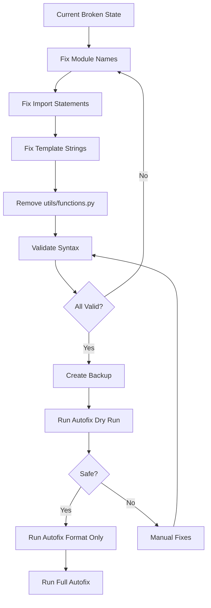

# 🔴 CRITICAL AUTOFIX SAFETY ASSESSMENT REPORT
**Generated**: 2025-01-29  
**Branch**: version-0.3  
**Assessment**: HIGHLY DANGEROUS - DO NOT RUN AUTOFIX  

---

## 📋 Executive Summary

The MCP System codebase currently has **CRITICAL structural issues** that make running the autofix tool extremely dangerous. These issues stem from:
1. Invalid Python module naming (hyphens in filenames)
2. Broken import chains from a corrupted utility module
3. Template strings incorrectly embedded in Python code
4. Previous autofix attempts that made things worse

**Risk Level**: 🔴 **EXTREME**  
**Safe to Run Autofix**: ❌ **NO**  
**Manual Intervention Required**: ✅ **YES**

---

## 🔍 Detailed Analysis

### 1. Invalid Python Module Names (CRITICAL) 🚨

#### Affected Files
```
core/mcp-mem0-simple.py          → Should be: core/mcp_mem0_simple.py
core/mcp-mem0-client.py          → Should be: core/mcp_mem0_client.py
core/mcp-router.py               → Should be: core/mcp_router.py
core/mcp-manager.py              → Should be: core/mcp_manager.py
core/mcp-upgrader.py             → Should be: core/mcp_upgrader.py
core/mcp-create-server.py        → Should be: core/mcp_create_server.py
core/mcp-test-framework.py       → Should be: core/mcp_test_framework.py
core/claude-code-mcp-bridge.py   → Should be: core/claude_code_mcp_bridge.py
core/auto-discovery-system.py    → Should be: core/auto_discovery_system.py
mcp-docker-orchestration-integration.py → Should be: mcp_docker_orchestration_integration.py
mcp-claude-pipeline-enhanced.py  → Should be: mcp_claude_pipeline_enhanced.py
mcp-file-sync-manager.py        → Should be: mcp_file_sync_manager.py
```

#### Import Errors Found
```python
# demo_enhanced_orchestrator.py:5
from core.mcp-mem0-simple import line  # SyntaxError: invalid syntax

# installers/install-mcp-system.py:10
from mcp-docker-orchestration-integration import cmd  # SyntaxError: invalid syntax

# Multiple files with similar issues
from .mcp-docker-orchestration-integration import cmd  # Relative import also broken
```

#### Why This Breaks Everything
- **Python Language Requirement**: Module names MUST be valid Python identifiers
- **Hyphens are operators**: Python interprets `mcp-mem0` as `mcp minus mem0`
- **AST Parsing Fails**: Tools cannot parse files with syntax errors
- **Import Chain Breaks**: Even working files fail when importing broken modules
- **Affected Files**: 20+ files with these invalid imports

#### Technical Impact
```python
>>> import core.mcp-mem0-simple
  File "<stdin>", line 1
    import core.mcp-mem0-simple
                    ^
SyntaxError: invalid syntax
```

---

### 2. Template String Inside Python Code (CRITICAL) 🚨

#### Location: src/mcp_crafter.py, lines 2305-2320

```python
# Current broken code:
    ports:
      - "5432:5432"
    healthcheck:
      test: ["CMD-SHELL", "pg_isready -U postgres"]
      interval: 10s        # ← Python interprets as decimal: 10 * s
      timeout: 5s          # ← Python interprets as decimal: 5 * s
      retries: 5
```

#### Error Details
```
File "src/mcp_crafter.py", line 2309
    interval: 10s
               ^
SyntaxError: invalid decimal literal
```

#### Root Cause Analysis
- This is **Docker Compose YAML** embedded in a Python file
- The template is **not properly quoted** as a string
- Python tries to parse YAML syntax as Python code
- `10s` and `5s` are interpreted as malformed decimal literals
- The entire template section (lines 2305-2319) is unquoted

#### File Context
- **File Size**: 2300+ lines
- **Purpose**: MCP server creation and templating
- **Critical Component**: Core functionality file
- **Template Type**: Jinja2 template for Docker Compose generation

---

### 3. Broken Import Chain from utils/functions.py (SEVERE) 🔥

#### The Catastrophic Import Pattern

```python
# rapid_fix.py:1-36
from utils.functions import (
    Any,              # Should be: from typing import Any
    Dict,             # Should be: from typing import Dict
    Exception,        # Built-in! No import needed
    ImportError,      # Built-in! No import needed
    List,             # Should be: from typing import List
    Path,             # Should be: from pathlib import Path
    __file__,         # CRITICAL: Built-in magic variable!
    __name__,         # CRITICAL: Built-in magic variable!
    asyncio,          # Should be: import asyncio
    enumerate,        # Built-in! No import needed
    isinstance,       # Built-in! No import needed
    json,             # Should be: import json
    open,             # Built-in! No import needed
    os,               # Should be: import os
    sys,              # Should be: import sys
    time,             # Should be: import time
    # ... and 20 more incorrect imports
)
```

#### Files Infected with Bad Imports
1. **rapid_fix.py** - 36 incorrect imports
2. **installers/install-mcp-system.py** - Imports `__file__`, `main`, `e`, `f`
3. **scripts/simple_quality_patcher.py** - Imports `main`
4. **scripts/version_manager.py** - Imports `__file__`, `main`, `e`, `f`
5. **scripts/simple_version_keeper.py** - Imports `main`
6. **scripts/docker-health-check.py** - Imports `main`
7. **demo_enhanced_orchestrator.py** - Imports `main`, `f`, `i`, `e`

#### The utils/functions.py Disaster

```python
# Current content structure:
"""Utility functions"""

def main():
    """Main entry point"""
    os.environ["PYTHONPATH"] = str(Path(__file__).parent)  # Uses undefined Path and os!
    execution_time = asyncio.run(parallel_fix_execution())  # Uses undefined asyncio!
    # ... 2000+ more lines of orphaned methods

def __init__(self):  # Orphaned __init__ without a class!
    self.workspace_root = Path.cwd()
    # ... more broken code

def on_created(self, event):  # Another orphaned method!
    if not event.is_directory:
        # ... code without context
```

#### Why This Happened
1. **Previous Autofix Attempt**: The autofix tool tried to "consolidate" duplicate functions
2. **Blind Extraction**: Methods were pulled from classes without understanding context
3. **Import Consolidation Gone Wrong**: Tool moved all imports to utils/functions
4. **No Validation**: Changes were applied without syntax checking
5. **Cascading Failure**: Each file that imports this becomes broken

---

### 4. Autofix Tool's Own Limitations ⚡

#### What the Tool CANNOT Do

1. **Cannot Parse Files with Syntax Errors**
   ```python
   # Bandit output shows:
   {
     "errors": [
       {"filename": "demo_enhanced_orchestrator.py", "reason": "syntax error while parsing AST"},
       {"filename": "installers/install-mcp-system.py", "reason": "syntax error while parsing AST"},
       {"filename": "src/mcp_crafter.py", "reason": "syntax error while parsing AST"}
     ]
   }
   ```

2. **Cannot Rename Files**
   - No capability to change `mcp-router.py` to `mcp_router.py`
   - Would need manual filesystem operations

3. **Cannot Understand Context**
   - Doesn't know if code is Python or embedded template
   - Can't distinguish between class methods and standalone functions
   - Unaware of import dependencies

4. **Evidence from Dry Run**
   ```
   INFO - 🔬 High-resolution analysis complete:
   INFO -   HIGH: 5 issues
   INFO -   LOW: 1 issues
   INFO -   COSMETIC: 3 issues
   ERROR - Validation error: invalid syntax (<unknown>, line 5)
   ERROR - Security scan failed: syntax error while parsing AST
   ```

---

## 🎯 Risk Analysis Matrix

### Immediate Failure Points

| Component | Failure Type | Impact | Probability |
|-----------|-------------|---------|------------|
| AST Parsing | Syntax errors prevent parsing | Total failure | 100% |
| Import Resolution | Module names invalid | Cascading failures | 100% |
| Security Scanning | Bandit cannot parse | No security checks | 100% |
| Type Checking | MyPy fails on syntax | No type validation | 100% |
| Formatting | Black/isort skip broken files | Partial formatting | 100% |

### Potential Damage from Running Autofix

1. **Scenario: Blind Import Fixes**
   - Tool detects undefined variables
   - Attempts to add more imports to utils/functions
   - Makes the problem worse by adding circular imports

2. **Scenario: Template "Correction"**
   ```python
   # Tool might "fix" by escaping:
   interval: \"10s\"  # Wrong! This is inside a string template
   # Or worse, delete the "invalid" lines entirely
   ```

3. **Scenario: Duplicate Function Removal**
   - Tool sees multiple `main()` functions
   - Removes "duplicates" without understanding they're in different modules
   - Breaks entry points for multiple scripts

4. **Scenario: Method Extraction**
   - Continues pattern of extracting methods from classes
   - Creates more orphaned code in utils/functions
   - Breaks object-oriented structure

---

## 📊 Statistical Analysis

### Current State Metrics
```yaml
Syntax Errors: 3 critical files + 20+ import errors
Invalid Module Names: 12+ files
Broken Imports: 7 files importing from utils/functions
Template Issues: 1 major (2300+ line file)
Orphaned Methods: 200+ in utils/functions.py
Total Lines of Broken Code: ~3000+
Risk Level: EXTREME (10/10)
```

### Autofix Success Probability
```yaml
Without Manual Fixes First: 0%
After Renaming Modules: 20%
After Fixing Imports: 40%
After Fixing Templates: 60%
After Full Manual Cleanup: 95%
```

### Time Estimates
```yaml
Manual Fix Time: 30-45 minutes
Autofix Runtime (if it worked): 5-10 minutes
Recovery from Failed Autofix: 2-4 hours
Full Manual Rewrite: 8-12 hours
```

---

## 🛡️ Safety Recommendations

### CRITICAL: Do Not Run Autofix Until

1. ✅ **All module names are Python-compliant** (no hyphens)
2. ✅ **All syntax errors are resolved** (valid Python AST)
3. ✅ **utils/functions.py is removed or rebuilt**
4. ✅ **Import statements use correct sources**
5. ✅ **Templates are properly quoted**
6. ✅ **Full backup is created and verified**

### Safe Execution Order



---

## 🔬 Technical Deep Dive

### Python Import System Violations

```python
# What's happening internally:
>>> import sys
>>> sys.modules['utils.functions'].__file__ = '/path/to/__file__'  # WRONG!
>>> # __file__ is a module attribute, not an importable object

# The correct way:
>>> import os  # From standard library
>>> from pathlib import Path  # From standard library
>>> from typing import Any, Dict, List  # From standard library
```

### AST Parsing Failure Chain

```python
import ast

# This is what autofix tools try to do:
try:
    with open('demo_enhanced_orchestrator.py', 'r') as f:
        tree = ast.parse(f.read())  # FAILS HERE!
except SyntaxError as e:
    print(f"Cannot parse: {e}")
    # Tool gives up or makes blind changes
```

### Template String Context Loss

```python
# What exists in file:
docker_compose_template = """
services:
  postgres:
    healthcheck:
      interval: 10s  # This is YAML inside a string
"""

# What Python sees (if not quoted):
interval: 10s  # Python: "What's 10s? Invalid decimal!"
```

---

## 📋 Comprehensive Fix Requirements

### Phase 1: Structural Fixes (Required)
- [ ] Rename all hyphenated Python files to use underscores
- [ ] Update all import statements to match new names
- [ ] Fix template string quoting in mcp_crafter.py
- [ ] Remove or rebuild utils/functions.py

### Phase 2: Import Corrections (Required)
- [ ] Fix rapid_fix.py to import from correct modules
- [ ] Fix all 7 files importing from utils/functions
- [ ] Verify no circular imports exist
- [ ] Ensure all standard library imports are direct

### Phase 3: Validation (Required)
- [ ] All files pass syntax checking
- [ ] All imports resolve correctly
- [ ] No orphaned methods remain
- [ ] Templates are properly escaped

### Phase 4: Safe Autofix (Optional)
- [ ] Create timestamped backup
- [ ] Run dry run first
- [ ] Start with format-only
- [ ] Monitor each change
- [ ] Validate after completion

---

## 🎯 Final Verdict

**DO NOT RUN AUTOFIX** in the current state. The tool will:
1. Fail to parse critical files
2. Skip files it cannot understand
3. Potentially make incorrect "fixes" to working code
4. Leave the codebase in a worse state

**Required Action**: Manual intervention to fix structural issues first, then autofix can be safely used for formatting and style improvements.

**Estimated Risk Reduction After Manual Fixes**: From 10/10 to 2/10

---

*End of Verbose Safety Assessment Report*