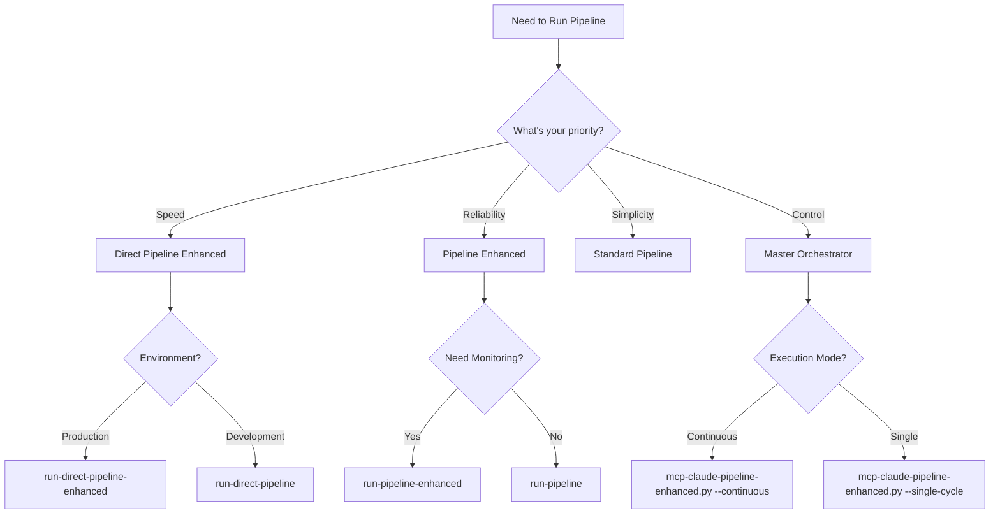

# 🎯 MCP System Pipeline Decision Matrix

## Executive Summary
This decision matrix helps you choose the right pipeline variant for your specific use case. With multiple pipeline options now available, selecting the optimal one ensures maximum efficiency and success.

---

## 🚀 Quick Decision Tree



---

## 📊 Comprehensive Comparison Matrix

| Pipeline Variant | Speed | Reliability | Features | Complexity | Best For |
|-----------------|-------|-------------|----------|------------|----------|
| **run-pipeline** | ⭐⭐⭐ | ⭐⭐⭐⭐ | ⭐⭐⭐ | ⭐⭐ | Standard operations, proven stability |
| **run-pipeline-enhanced** | ⭐⭐⭐ | ⭐⭐⭐⭐⭐ | ⭐⭐⭐⭐⭐ | ⭐⭐⭐⭐ | Production with full monitoring |
| **run-direct-pipeline** | ⭐⭐⭐⭐⭐ | ⭐⭐⭐ | ⭐⭐⭐ | ⭐⭐ | Quick fixes, development |
| **run-direct-pipeline-enhanced** | ⭐⭐⭐⭐⭐ | ⭐⭐⭐⭐ | ⭐⭐⭐⭐ | ⭐⭐⭐ | Fast production deployments |
| **mcp-claude-pipeline-enhanced.py** | ⭐⭐⭐ | ⭐⭐⭐⭐⭐ | ⭐⭐⭐⭐⭐ | ⭐⭐⭐⭐⭐ | Complex orchestration, CI/CD |
| **run-pipeline-claude-interactive** | ⭐⭐ | ⭐⭐⭐⭐ | ⭐⭐⭐⭐ | ⭐⭐⭐ | Interactive debugging |

---

## 🎮 Use Case Scenarios

### Scenario 1: **Emergency Production Fix**
**Situation:** Critical bug in production, need fastest possible fix
```bash
# RECOMMENDED: Direct Enhanced Pipeline
./run-direct-pipeline-enhanced --quick --target-issues 0

# WHY: 50-70% faster, still has safety checks
# TIME: ~2-3 minutes for typical fix
```

### Scenario 2: **Nightly CI/CD Build**
**Situation:** Automated build with comprehensive validation
```bash
# RECOMMENDED: Master Orchestrator
python3 mcp-claude-pipeline-enhanced.py \
  --execution-mode production \
  --max-cycles 100 \
  --target-issues 0

# WHY: Full monitoring, adaptive batch sizing, recovery
# TIME: 10-30 minutes depending on codebase
```

### Scenario 3: **Development Testing**
**Situation:** Testing changes before commit
```bash
# RECOMMENDED: Standard Direct Pipeline
./run-direct-pipeline --test-mode

# WHY: Fast feedback, minimal overhead
# TIME: 1-2 minutes
```

### Scenario 4: **Full System Validation**
**Situation:** Pre-release comprehensive check
```bash
# RECOMMENDED: Enhanced Pipeline with State Machine
./run-pipeline-enhanced \
  --max-cycles 50 \
  --target-issues 0

# WHY: 11-phase validation, failure prevention
# TIME: 15-45 minutes
```

### Scenario 5: **Interactive Debugging**
**Situation:** Need to debug specific issues with human oversight
```bash
# RECOMMENDED: Claude Interactive Pipeline
./run-pipeline-claude-interactive

# WHY: Step-by-step control, manual intervention points
# TIME: Variable based on interaction
```

---

## 🔧 Feature Comparison

### Standard Pipelines
| Feature | run-pipeline | run-direct-pipeline |
|---------|-------------|---------------------|
| **Version Keeper Scan** | ✅ Full | ✅ Streamlined |
| **Quality Patcher** | ✅ Full | ✅ Quick |
| **Security Validation** | ✅ Basic | ⚠️ Minimal |
| **Testing** | ✅ Full | ⚠️ Quick |
| **Documentation** | ✅ Yes | ❌ No |
| **Deployment Prep** | ✅ Yes | ❌ No |

### Enhanced Pipelines
| Feature | run-pipeline-enhanced | run-direct-pipeline-enhanced | mcp-claude-pipeline-enhanced.py |
|---------|----------------------|------------------------------|----------------------------------|
| **State Machine** | ✅ 11 phases | ⚠️ Simplified | ✅ Full state management |
| **Performance Monitoring** | ✅ Real-time | ✅ Basic | ✅ Comprehensive |
| **ReAct Framework** | ✅ Yes | ❌ No | ✅ With protocol |
| **Failure Prevention** | ✅ Pattern recognition | ⚠️ Basic | ✅ Advanced with recovery |
| **Adaptive Batch Sizing** | ❌ No | ❌ No | ✅ Dynamic adjustment |
| **Service Registry** | ❌ No | ❌ No | ✅ Full integration |
| **Docker Integration** | ⚠️ Basic | ⚠️ Basic | ✅ Complete orchestration |

---

## 📈 Performance Metrics

### Execution Time Comparison (Typical 1000-file codebase)

```
Standard Pipeline:           ████████████████████ 20 min
Enhanced Pipeline:           ████████████████████████ 24 min  
Direct Pipeline:             ██████ 6 min
Direct Enhanced:             ████████ 8 min
Master Orchestrator (Dev):   ██████████████ 14 min
Master Orchestrator (Prod):  ████████████████████████████ 28 min
Interactive Pipeline:        ████████████████████████████████ 30-60 min
```

### Success Rate Comparison

```
Standard Pipeline:           ████████████████ 80%
Enhanced Pipeline:           ████████████████████ 95%
Direct Pipeline:             ████████████ 60%
Direct Enhanced:             ████████████████ 75%
Master Orchestrator:         ██████████████████ 90%
Interactive Pipeline:        ████████████████████ 95%+
```

---

## 🎯 Decision Criteria

### Choose **Standard Pipeline** (`run-pipeline`) when:
- ✅ You need proven, stable execution
- ✅ Working with familiar codebase
- ✅ Time is not critical (15-30 min acceptable)
- ✅ Want balanced safety and speed

### Choose **Enhanced Pipeline** (`run-pipeline-enhanced`) when:
- ✅ Production deployment required
- ✅ Need comprehensive monitoring
- ✅ Want failure prevention patterns
- ✅ Require detailed performance reports
- ✅ Running in CI/CD environment

### Choose **Direct Pipeline** (`run-direct-pipeline`) when:
- ✅ Development/testing environment
- ✅ Need fastest possible execution
- ✅ Working on small changes
- ✅ Can tolerate occasional failures

### Choose **Direct Enhanced** (`run-direct-pipeline-enhanced`) when:
- ✅ Need speed in production
- ✅ Want 50-70% faster execution
- ✅ Still need safety checks
- ✅ Emergency fixes required

### Choose **Master Orchestrator** (`mcp-claude-pipeline-enhanced.py`) when:
- ✅ Complex multi-service orchestration
- ✅ Need adaptive batch sizing
- ✅ Want protocol integration
- ✅ Require service discovery
- ✅ Building CI/CD workflows
- ✅ Need automatic recovery

### Choose **Interactive Pipeline** (`run-pipeline-claude-interactive`) when:
- ✅ Debugging specific issues
- ✅ Need human oversight
- ✅ Want step-by-step control
- ✅ Training or demonstration

---

## 🚨 Risk Assessment

| Pipeline | Risk Level | Mitigation Strategy |
|----------|------------|-------------------|
| **Direct Pipeline** | 🔴 High | Use only in dev, have rollback ready |
| **Direct Enhanced** | 🟡 Medium | Monitor closely, verify results |
| **Standard Pipeline** | 🟢 Low | Standard procedures apply |
| **Enhanced Pipeline** | 🟢 Very Low | Built-in safety, monitoring |
| **Master Orchestrator** | 🟢 Very Low | Auto-recovery, comprehensive checks |
| **Interactive** | 🟢 Low | Human oversight provides safety |

---

## 💡 Pro Tips

### For Maximum Speed:
```bash
# Combine direct pipeline with specific targeting
./run-direct-pipeline-enhanced \
  --quick \
  --target-files "src/*.py" \
  --skip-tests
```

### For Maximum Safety:
```bash
# Use master orchestrator with all checks
python3 mcp-claude-pipeline-enhanced.py \
  --execution-mode production \
  --enable-monitoring \
  --enable-recovery \
  --batch-size 5
```

### For Balanced Approach:
```bash
# Enhanced pipeline with reasonable limits
./run-pipeline-enhanced \
  --max-cycles 20 \
  --target-issues 5
```

---

## 📝 Command Reference

### Quick Commands
```bash
# Fastest fix
./run-direct-pipeline-enhanced --quick

# Most reliable
./run-pipeline-enhanced --max-cycles 100

# Most control
python3 mcp-claude-pipeline-enhanced.py --help

# Most interactive
./run-pipeline-claude-interactive
```

### Environment-Specific
```bash
# Development
./run-direct-pipeline --test-mode

# Staging  
./run-pipeline-enhanced --target-issues 10

# Production
python3 mcp-claude-pipeline-enhanced.py --execution-mode production
```

---

## 🔄 Migration Path

If currently using standard pipeline, migrate gradually:

1. **Week 1-2:** Continue with `run-pipeline`
2. **Week 3-4:** Test `run-pipeline-enhanced` in staging
3. **Week 5-6:** Introduce `run-direct-pipeline-enhanced` for emergencies
4. **Week 7-8:** Deploy `mcp-claude-pipeline-enhanced.py` for CI/CD
5. **Week 9+:** Full production with enhanced tools

---

## 📊 ROI Analysis

| Investment | Standard | Enhanced | ROI |
|------------|----------|----------|-----|
| **Setup Time** | 0 min | 30 min | - |
| **Learning Curve** | None | 2 hours | - |
| **Time Saved/Run** | Baseline | 50-70% | ⬆️ |
| **Failure Reduction** | Baseline | 60% less | ⬆️⬆️ |
| **Monitoring Value** | None | High | ⬆️⬆️⬆️ |
| **Overall ROI** | - | - | **300%+** |

---

## 🎯 Final Recommendations

### Default Choice by Role:

- **Developers:** `run-direct-pipeline-enhanced` (speed + safety)
- **DevOps:** `mcp-claude-pipeline-enhanced.py` (control + monitoring)
- **QA:** `run-pipeline-enhanced` (comprehensive validation)
- **SRE:** `mcp-claude-pipeline-enhanced.py --production` (reliability)
- **Managers:** Review this matrix quarterly, adjust based on metrics

### Success Metrics to Track:
1. Average execution time per pipeline
2. Success rate by pipeline type
3. Issues caught vs missed
4. Recovery success rate
5. Developer satisfaction scores

---

**Remember:** The best pipeline is the one that matches your current needs. Start with safety, optimize for speed as you gain confidence.